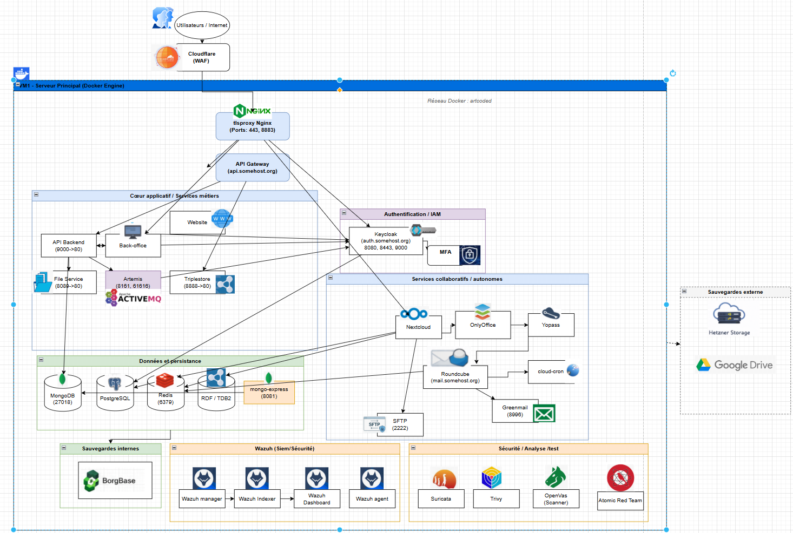

# Artcoded SOC Lab
## Présentation générale

Artcoded SOC Lab est une infrastructure de cybersécurité self-hosted conçue pour simuler un environnement d’entreprise moderne segmenté et supervisé.

Le projet combine plusieurs composants de sécurité offensifs et défensifs afin de centraliser :

- la détection d’intrusion ;
- l’analyse des vulnérabilités ;
- la supervision de sécurité ;
- le monitoring réseau ;
- la collecte de logs ;
- la génération de rapports de sécurité.

L’infrastructure repose principalement sur Docker et plusieurs réseaux segmentés afin d’isoler les différents services applicatifs, IAM, bases de données et composants de sécurité.

Les principales solutions intégrées sont :

- **Wazuh** : SIEM / HIDS / centralisation des logs ;
- **Suricata** : IDS réseau et analyse du trafic ;
- **OpenVAS** : scanner de vulnérabilités ;
- **Trivy** : analyse de vulnérabilités des images Docker ;
- **Atomic Red Team** : simulation contrôlée de techniques d’attaque ;
- **Nextcloud / Keycloak / PostgreSQL / MongoDB / Redis** : services applicatifs du laboratoire.

L’objectif du laboratoire est de fournir un environnement réaliste permettant :
- l’apprentissage ;
- le test ;
- la démonstration ;
- la supervision ;
- ainsi que l’analyse d’événements de sécurité dans une architecture conteneurisée.
# Architecture


# Wazuh – SIEM / HIDS

## Présentation

Wazuh est le composant central du SOC Lab Artcoded.

Il permet :

* la centralisation des logs ;
* la supervision de sécurité ;
* l’analyse des événements ;
* la détection d’intrusions ;
* le monitoring des agents ;
* l’intégration IDS ;
* la corrélation d’événements ;
* la visualisation des alertes.

Dans l’infrastructure Artcoded, Wazuh est utilisé avec :

* Suricata ;
* Docker ;
* OpenVAS ;
* les logs système ;
* les services applicatifs.

---

# Architecture Wazuh

L’infrastructure Wazuh repose sur :

* Wazuh Manager ;
* Wazuh Indexer ;
* Wazuh Dashboard ;
* Wazuh Agent.

---

# Intégration Suricata

Suricata génère les événements réseau dans :

```text
/var/log/suricata/eve.json
```

Ces événements sont :

```text
Suricata
→ eve.json
→ Wazuh Agent
→ Wazuh Manager
→ Filebeat
→ Wazuh Indexer
→ Dashboard
```

Les alertes sont ensuite visualisables dans :

```text
Dashboard Management / Discover
```

ou dans les dashboards personnalisés.

---

# Dashboard personnalisé

Un dashboard exporté est fourni dans :

```text
config/wazuh/wazuh_dashboard/home.ndjson
```

Ce dashboard contient :

* visualisation des alertes ;
* timeline ;
* statistiques ;
* monitoring ;
* événements Suricata.

---

# Import du dashboard

## Menu

```text
Dashboard Management → Saved Objects
```

## Import

Importer :

```text
config/wazuh/wazuh_dashboard/home.ndjson
```

Puis :

```text
Import
```

Le dashboard sera automatiquement ajouté à Wazuh Dashboard.

---

# Accès Wazuh Dashboard

## URL

```text
https://IP_VM:8443
```

Exemple :

```text
https://10.10.0.165:8443
```

---

# Découverte des événements

## Discover

Les événements sont consultables dans :

```text
Discover
```

Index utilisés :

```text
wazuh-alerts-*
```

---

# Types d’événements collectés

Le SOC peut centraliser :

* logs système ;
* événements Suricata ;
* alertes IDS ;
* logs Docker ;
* logs applicatifs ;
* événements sécurité ;
* détections personnalisées.


# OpenVAS – Artcoded SOC Lab

## Présentation

OpenVAS (Greenbone Vulnerability Management) est utilisé dans l’infrastructure Artcoded comme scanner de vulnérabilités réseau et applicatives.

Il permet :

* la détection de services exposés ;
* l’identification de vulnérabilités et CVE ;
* l’analyse de mauvaises configurations ;
* le suivi des vulnérabilités dans le temps ;
* la génération automatisée de rapports ;
* l’envoi d’alertes par email.

OpenVAS complète :

* Wazuh → SIEM / logs / FIM ;
* Trivy → scan des images Docker ;
* Suricata → IDS réseau ;
* Atomic Red Team → simulation d’attaques.

---

# Déploiement

## Docker Compose

```yaml
services:
  openvas:
    image: immauss/openvas:latest
    container_name: openvas
    restart: unless-stopped

    ports:
      - "9392:9392"

    volumes:
      - openvas_data:/data

volumes:
  openvas_data:
```

---

# Premier démarrage

> **WARNING**
> Lors du premier lancement, OpenVAS télécharge :

* les feeds CVE ;
* les NVT ;
* les données SCAP ;
* les CERT ;
* les signatures.

Cette étape peut prendre longtemps selon :

* la bande passante ;
* le CPU ;
* le stockage.

Pendant cette phase :

* les scans sont indisponibles ;
* l’UI peut afficher :

```text
Feed is currently syncing.
```

Une fois terminé :

* les services OpenVAS démarrent ;
* les scans deviennent disponibles.

---

# Accès Web

## URL

```text
http://IP_VM:9392
```

Exemple :

```text
http://10.10.0.165:9392
```

> **WARNING**
> Cette instance utilise HTTP.

---

# Architecture réseau

Le réseau Docker principal Artcoded est :

```text
172.31.0.0/16
```

OpenVAS est connecté au bridge Docker :

```text
artcoded_artcoded
```

Il peut donc scanner :

* les conteneurs ;
* les services internes ;
* les ports exposés ;
* les applications web ;
* les bases de données ;
* les services d’administration.

---

# Création d’une Target

## Menu

```text
Configuration → Targets
```

## Paramètres utilisés

### Hosts

```text
172.31.0.0/16
```

### Alive Test

```text
Consider Hosts as Alive
```

Cela évite les faux négatifs dans les réseaux Docker internes.

---

# Création d’une Task

## Menu

```text
Scans → Tasks
```

## Configuration utilisée

### Scan Config

```text
Full and fast
```

### Scanner

```text
OpenVAS Default
```

### Target

```text
artcoded
```

---

# Lancement manuel

Depuis :

```text
Scans → Tasks
```

Puis :

```text
Start
```

---

# Planification automatique

OpenVAS possède son propre scheduler intégré.

## Création d’un Schedule

```text
Configuration → Schedules
```

## Exemple

### Fréquence

```text
Weekly
```

### Jour

```text
Saturday
```

### Heure

```text
22:00 UTC
```

---

# Association du schedule

```text
Scans → Tasks → Edit Task
```

Puis sélectionner :

* le Schedule ;
* sauvegarder.

Le scan sera ensuite exécuté automatiquement.

---

# Rapports

## Consultation

```text
Scans → Reports
```

Les rapports affichent :

* CVE détectées ;
* niveau de sévérité ;
* ports ouverts ;
* services ;
* résultats détaillés ;
* historique des scans.

---

# Génération de rapports personnalisés

OpenVAS permet :

* filtres ;
* composition du contenu ;
* inclusion des certificats TLS ;
* pagination ;
* exports.

Formats possibles :

* PDF ;
* XML ;
* TXT ;
* HTML.

---

# Alertes Email

OpenVAS peut envoyer automatiquement un email lorsqu’un scan est terminé.

## Configuration

```text
Configuration → Alerts
```

## Fonctionnalités possibles

* notification simple ;
* inclusion du rapport ;
* comparaison avec rapport précédent ;
* filtres ;
* génération automatique.

---

# Consommation de ressources

## Pendant initialisation / scan

OpenVAS peut fortement consommer :

* CPU ;
* RAM ;
* I/O disque.

Principalement :

* lors des updates feeds ;
* pendant les scans actifs ;
* sur grands réseaux.

---

## Au repos

Une fois :

* les feeds synchronisés ;
* les tâches terminées ;

OpenVAS consomme relativement peu de ressources et peut rester allumé en permanence.

---

# Intégration SOC

## Wazuh

Complémentaire :

* OpenVAS = vulnérabilités ;
* Wazuh = événements/logs/détection.

---

## Trivy

Complémentaire :

* OpenVAS = réseau/services ;
* Trivy = images Docker/packages/libs.

---

## Suricata

Complémentaire :

* OpenVAS = analyse proactive ;
* Suricata = détection trafic réseau.

---

## Atomic Red Team

Complémentaire :

* Atomic = simulation ;
* OpenVAS = vérification exposition.

---

# Sécurité

## Recommandations

Ne pas exposer OpenVAS directement sur Internet :

* accès LAN uniquement ;
* VPN ;
* reverse proxy sécurisé ;
* MFA ;
* filtrage IP.

---

# Conclusion

OpenVAS apporte :

* une vision réseau globale ;
* l’identification proactive des vulnérabilités ;
* le suivi de l’exposition des services ;
* l’automatisation des audits de sécurité.

Dans l’infrastructure Artcoded, il constitue le composant principal de gestion des vulnérabilités du SOC lab.
